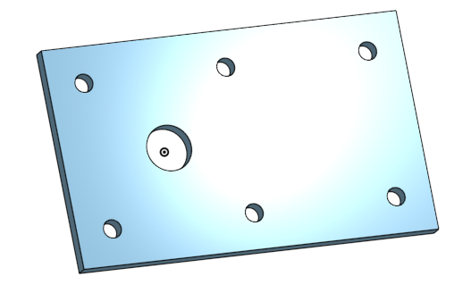
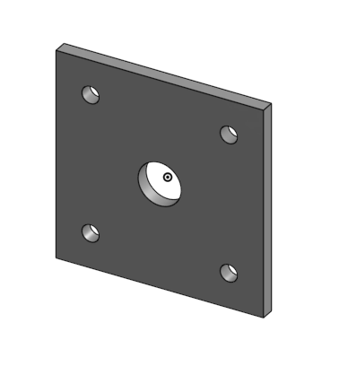
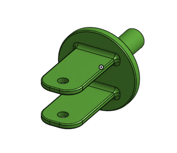
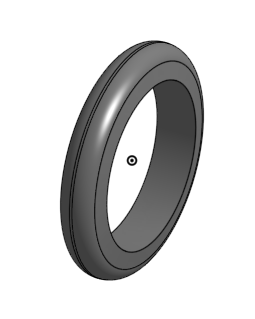
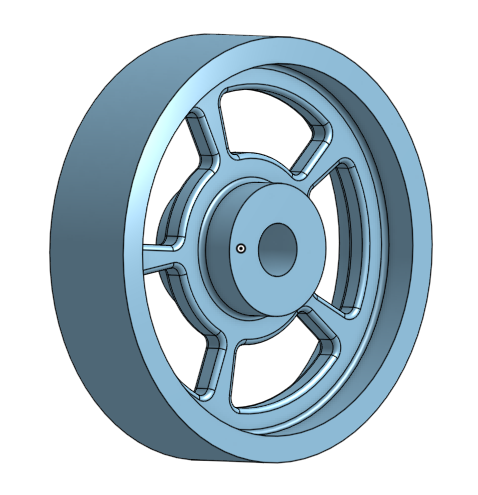
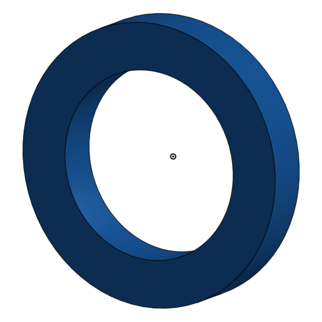
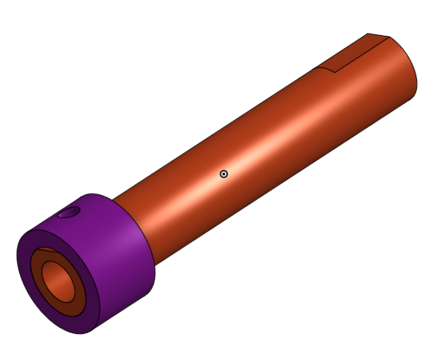
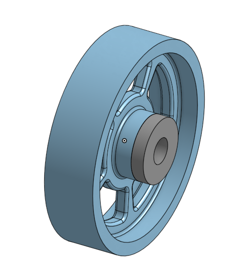
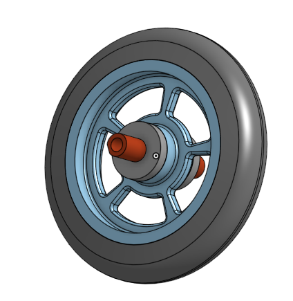
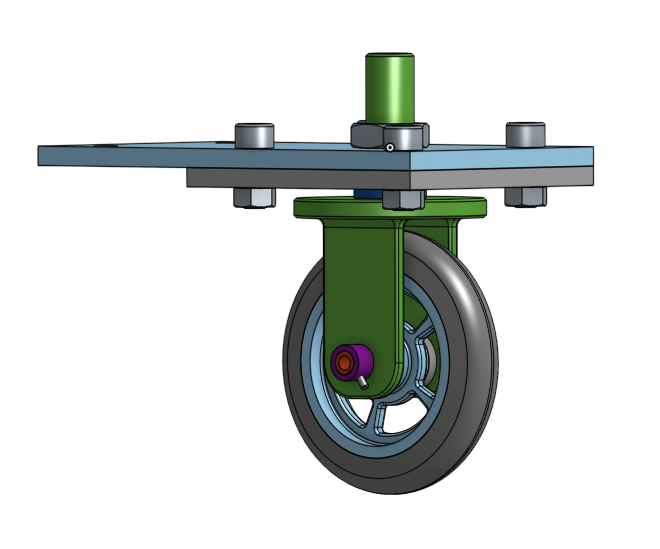

# BasicCAD

## The Base

This was my first assignment. I had to create the Base of the Caster.

[The Base]
https://cvilleschools.onshape.com/documents/3947cf5164693d02cafed0e4/w/23c7aaeca2be2d465fe6b4d9/e/ea51eadba9f8ee33f2e575b3

I commpleted The Base. I did not have very much trouble making it because the instructions were relativley simple and clear. I did however, struggle a little when I needed to use the linear pattern function, but I figured it out after a little bit of thinking and it was all good.

---

## The Mount

For this assignment I had to create the Mount for the Caster.

[The Mount]
https://cvilleschools.onshape.com/documents/3947cf5164693d02cafed0e4/w/23c7aaeca2be2d465fe6b4d9/e/466fa8520292b4232cd4b853

I completed The Mount. I did not have any problems when completing this assignment due to the instructions being clear.  I liked how in the instruction video he showed multiple different ways you could make the part and explained the benefits and drawbacks of each method.

---

## Fork

For this assignment I had to create the Fork for the Caster.

[The Fork]
https://cvilleschools.onshape.com/documents/3947cf5164693d02cafed0e4/w/23c7aaeca2be2d465fe6b4d9/e/93496fe9977356eb2befa7d6

I completed the Fork. I had fun making this part because I did not struggle but the part was complex and took lots of different features to complete.

---

## Tire

For this assignment I had to create the Tire for the Caster.

[The Tire]
https://cvilleschools.onshape.com/documents/3947cf5164693d02cafed0e4/w/23c7aaeca2be2d465fe6b4d9/e/00a202a32d0fbdea329cda0b

I completed the Tire. This assignment did not take very long because the video was short and even though the part might look complex it is just a simple sketch that turned into a cool shape when I revolved it.

---

## Wheel

For this assignment I had to create the Wheel for the Caster.

[The Wheel]
https://cvilleschools.onshape.com/documents/3947cf5164693d02cafed0e4/w/23c7aaeca2be2d465fe6b4d9/e/32c0a0d4df0a1eee6cec15a3

I completed the Wheel. I liked making this part even though I did not think it was very difficult because I thought that the process of making it was very appealing like after I revolved the sketch and put in all the fillets.

---

## AxleCollarBearings

For this assignment I had to create the Axle, Collar and Bearings for the Caster.

[AxleCollarBearings]
https://cvilleschools.onshape.com/documents/3947cf5164693d02cafed0e4/w/23c7aaeca2be2d465fe6b4d9/e/c4ac747fffd56a37205bf2aa

I completed the Axle, Collar and Bearings. I thought this was an interesting project because it involed making multiple parts and conecting them. Now that I am done with all the parts I am exited to start assembiling them to make the caster.

---

## Sub Assembly

For this assignment I had to make a sub assembly for the caster.

[Sub Assembly]
https://cvilleschools.onshape.com/documents/3947cf5164693d02cafed0e4/w/23c7aaeca2be2d465fe6b4d9/e/f3cd2540009f560f256eb7d9

I completed the sub assembly for the caster. This was an interesting assignment because it involved building things in an assembly which I had not done before. It wasn't too hard to make but I did struggle a little more than I usually do because it was a new type of design.

##  Final Assembly

For this assignment I finished making the caster in the final assembly.

[Final Assembly]
https://cvilleschools.onshape.com/documents/3947cf5164693d02cafed0e4/w/23c7aaeca2be2d465fe6b4d9/e/8efe6d6203a5debab26185e8

I now have fully assembled the caster. The final assembly was the most challenging CAD assignment so far. I got stuck a few times. The worst time was when I couldn't figure out how to attach the collars. Eventually, after trying many different things I was able to figure it out and complete the final assembly.
